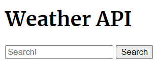

# Weather-Api

## Description

The purpose of this project was to use a server side API to build a weather app where the user could type in a city name and the application would display weather information for that city for today and for five days into the future. The application requirements also require stylistic changes to the page depending on what the weather is in the city being searched.

## Shout out
Credit is due to Joshua Rae, Freddy Kwak, and Juliana Lamond as they are all part of my study group. 

## Link
See page at: https://tabithaly.github.io/weather-api/